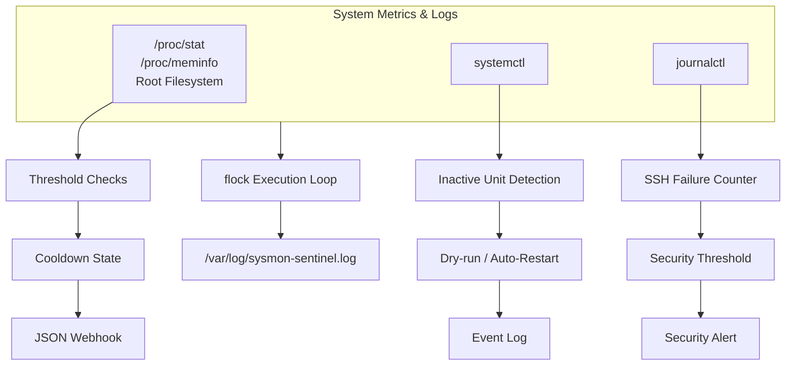

# sysmon-sentinel

[](https://github.com/Wickliffo/sysmon-sentinel/actions/workflows/lint.yml )
[](https://www.shellcheck.net/ )
[](LICENSE)

> **A low-overhead Linux monitoring and self-healing agent for small servers.**
>
> Detect resource pressure, recover failed systemd services, identify SSH brute-force activity, and notify an operator without deploying a heavyweight SaaS agent.

## Why this exists

A small production server can fail in several expensive ways while appearing healthy from the outside. A background service can crash silently. A memory leak can consume available RAM until a database is killed by the kernel. A full root filesystem can stop writes and break an otherwise healthy application. Meanwhile, public SSH ports are continuously probed by automated scanners.

For a small EC2 instance, homelab, edge node, or side-project server, the usual choices are uncomfortable: pay for a full monitoring platform, accept delayed detection, or build a large agent that consumes the resources it is supposed to protect.

**sysmon-sentinel is a deliberately small alternative.** It uses Linux-native interfaces and tools already present on most distributions, keeps the operational model understandable, and focuses on the first response that matters: detect the problem, attempt a controlled recovery, and tell a human what happened.

## The problem → solution

| Operational problem | What sysmon-sentinel does | Why it matters |
|---|---|---|
| A service crashes silently | Checks configured systemd services and can restart inactive units | Reduces avoidable downtime before an operator investigates |
| CPU, memory, or disk pressure builds unnoticed | Reads `/proc`, checks the root filesystem, and compares values with thresholds | Gives an early warning before workloads become unavailable |
| SSH receives repeated authentication failures | Counts recent failure patterns in `journalctl` | Surfaces brute-force activity without installing a security platform |
| Monitoring tooling adds cost and overhead | Runs as a small Bash process using standard Linux utilities | Fits resource-constrained hosts and learning environments |
| A webhook outage creates alert noise | Uses file-based alert cooldown state | Prevents the same incident from generating a message every polling cycle |
| Logs grow until the disk fills | Ships a logrotate policy | Keeps the monitor from creating the failure it is meant to detect |

## What makes this a strong engineering project

This is not just a shell script that prints metrics. It demonstrates practical production engineering around a privileged operational tool:

- **Linux systems knowledge:** `/proc/stat`, `/proc/meminfo`, `systemctl`, `journalctl`, `flock`, systemd units, and logrotate.
- **Reliability thinking:** dry-run mode, one-shot execution, restart-on-failure, lock protection, alert cooldowns, and reversible uninstall behavior.
- **Security awareness:** webhook secrets live outside Git, the service uses systemd hardening directives, and a security policy documents root privileges and reporting.
- **Quality automation:** ShellCheck, shfmt, syntax checks, smoke tests, mock integration tests, and SHA256-verified CI tool downloads.
- **Operational documentation:** installation, configuration, safe testing, failure modes, and deployment trade-offs are documented for the next operator.

## How it works

The issue with ASCII box-drawing characters (like `┌`, `─`, `┤`) is that GitHub's editor font and variable-width text rendering often misalign or disconnect them.

To fix this, we have two reliable options:

---

### Option 1: Native GitHub Mermaid Diagram (Recommended)

GitHub natively renders **Mermaid syntax** into SVG diagrams. Replace lines 42–55 in your `README.md` with this block:

```markdown


```

---

### Option 2: Clean Standard ASCII (Guaranteed Monospace Alignment)
If you prefer pure text without Mermaid rendering, use standard ASCII characters (`+`, `-`, `|`). These align reliably across all text editors and GitHub previews:

```text
  +-----------------+
  |   /proc/stat    |--+
  |  /proc/meminfo  |  |--> Threshold Checks --> Cooldown --> JSON Webhook
  | Root Filesystem |--+
  +-----------------+
  +-----------------+
  |    systemctl    |-----> Inactive Unit   ---> Dry-run / Restart --> Event Log
  +-----------------+
  +-----------------+
  |   journalctl    |-----> SSH Failures    ---> Threshold ----------> Security Alert
  +-----------------+

  All Checks ---------------> flock Execution ---> /var/log/sysmon-sentinel.log

```
  

The monitor is intentionally conservative. It does **not** kill arbitrary processes, change firewall rules, modify SSH configuration, or pretend to replace a full observability platform. It automates a narrow and useful first response while leaving diagnosis and policy decisions visible to the operator.

## Quick start

### Install on a Linux host

```bash
git clone https://github.com/Wickliffo/sysmon-sentinel.git
cd sysmon-sentinel
sudo ./install.sh
```

The installer places the executable at `/usr/local/sbin/sysmon-sentinel`, installs configuration under `/etc/sysmon-sentinel`, installs the systemd unit and logrotate policy, creates restricted secret files, and enables the service.

### Configure the host

Edit the service allowlist and thresholds:

```bash
sudoedit /etc/sysmon-sentinel/sysmon-sentinel.conf
```

Only include services that are expected to run on that host. An absent or intentionally disabled service should not be in `SERVICES`.

For webhook notifications, store only the URL in the separate root-owned secret file:

```bash
sudo sh -c 'printf "%s\n" "https://your-webhook-url" > /etc/sysmon-sentinel/webhook.url'
sudo chmod 600 /etc/sysmon-sentinel/webhook.url
```

### Test safely before enabling recovery

```bash
sudo SYSMON_LOG_FILE=/tmp/sysmon-sentinel.log \
  ./bin/sysmon-sentinel.sh \
  --config /etc/sysmon-sentinel/sysmon-sentinel.conf \
  --dry-run --once
```

`--dry-run` reports the services it would restart without restarting them. `--once` makes the command return after one check cycle, which is useful for deployment validation and incident investigation.

### Operate it

```bash
sudo systemctl status sysmon-sentinel.service
sudo journalctl -u sysmon-sentinel.service -f
sudo tail -f /var/log/sysmon-sentinel.log
```

To remove the executable, systemd unit, and logrotate policy while retaining configuration:

```bash
sudo ./uninstall.sh
```

## Configuration highlights

| Setting | Default | Purpose |
|---|---:|---|
| `CHECK_INTERVAL` | `60` | Seconds between checks |
| `CPU_THRESHOLD` | `90` | CPU percentage that triggers an alert |
| `MEMORY_THRESHOLD` | `90` | Used-memory percentage that triggers an alert |
| `DISK_THRESHOLD` | `90` | Root filesystem percentage that triggers an alert |
| `SSH_FAILURE_THRESHOLD` | `20` | Matching SSH failures in the lookback window |
| `SSH_LOOKBACK` | `10 minutes ago` | Journal window for SSH analysis |
| `ALERT_COOLDOWN` | `900` | Seconds before the same event can notify again |
| `SERVICES` | example list | systemd units to audit and recover |

The configuration is Bash syntax because it supports arrays such as `SERVICES`. Treat it as a privileged file: keep it root-owned and non-writable by untrusted users.

## Testing and CI

Local tests require Bash and the standard Linux command-line environment:

```bash
tests/smoke.sh
tests/integration.sh
```

The integration test uses mocked `systemctl`, `journalctl`, and `curl` commands. It verifies inactive-service detection, SSH failure counting, webhook secret loading, and duplicate-alert suppression without changing the host or sending a real notification.

Every push and pull request runs:

1. ShellCheck with warning-level enforcement
2. shfmt formatting validation
3. Smoke tests
4. Mock integration tests
5. SHA256 verification for downloaded ShellCheck and shfmt binaries

## Honest scope and trade-offs

This project is designed for small, controlled Linux deployments and as a transparent reference implementation. It is not a replacement for Prometheus, Grafana, a SIEM, managed incident response, or a fleet-management platform.

Before using it on a high-value production host, review the service allowlist, protect the root-owned configuration, test restart behavior in staging, and decide whether automatic recovery is appropriate for each service. The monitor runs with root privileges because systemd recovery requires them; that privilege should be treated as a deployment boundary, not hidden as an implementation detail.

## Roadmap

The next valuable extensions would be a non-executing configuration parser, structured metrics export, retry/backoff for webhook delivery, richer systemd health checks, and integration tests across multiple Linux distributions.

## About the project

**Author:** [Wickliffo](https://github.com/Wickliffo )

This project is intended to demonstrate practical Linux automation, reliability engineering, security-conscious operations, and maintainable Bash development.

## License

MIT. See [LICENSE](LICENSE).

