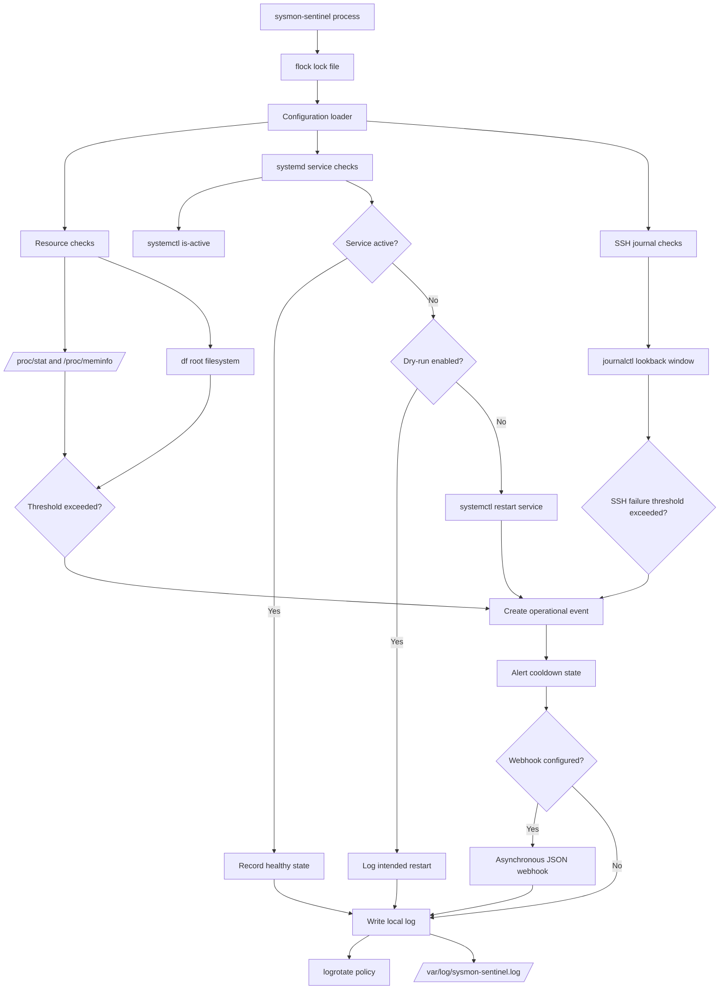
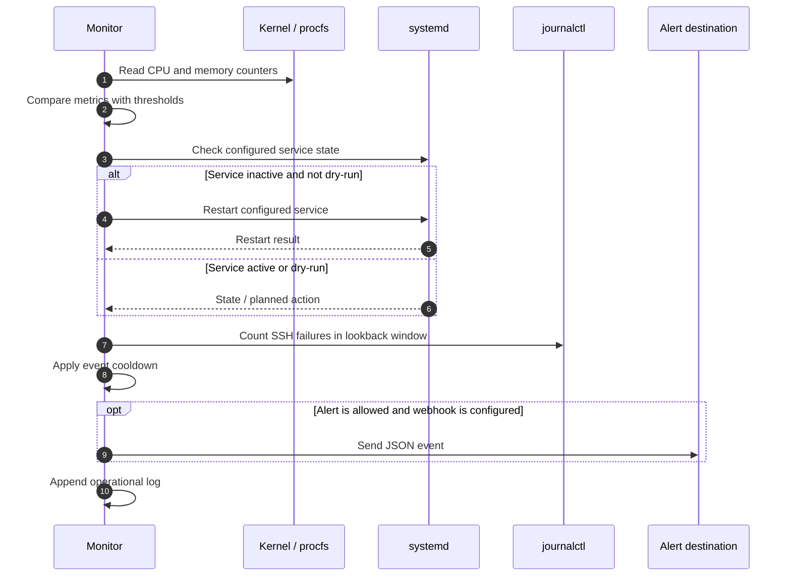

# sysmon-sentinel

[](https://github.com/Wickliffo/sysmon-sentinel/actions/workflows/lint.yml )
[](https://www.shellcheck.net/ )
[](LICENSE)

> **A low-overhead Linux monitoring and self-healing agent for small servers.**
>
> Detect resource pressure, recover failed systemd services, identify SSH brute-force activity, and notify an operator without deploying a heavyweight monitoring platform.

## The real-world problem

Small production servers often fail silently. A background service crashes, a memory leak consumes available RAM, a root filesystem fills up, or automated scanners generate repeated SSH authentication failures. The result is usually delayed detection, avoidable downtime, and manual recovery.

Traditional monitoring platforms can solve these problems, but they may be excessive for a small EC2 instance, homelab, edge node, or side-project server. They can add recurring cost, operational complexity, and resource overhead.

**sysmon-sentinel provides a focused alternative:** a transparent Bash-based monitor that uses Linux-native interfaces, attempts a controlled first response, and records what happened for an operator.

## Problem → solution

| Problem | Solution | Operational value |
|---|---|---|
| A systemd service crashes silently | Audit configured services and restart inactive units | Reduces avoidable downtime |
| CPU, memory, or disk pressure grows unnoticed | Read `/proc`, inspect the root filesystem, and compare against thresholds | Provides early warning before workloads fail |
| SSH is targeted by automated scanners | Count recent authentication-failure patterns in `journalctl` | Surfaces brute-force activity |
| Monitoring software is too heavy or expensive | Use Bash and standard Linux utilities | Fits small, resource-constrained hosts |
| A persistent incident creates alert spam | Apply per-event cooldown state | Keeps notifications actionable |
| Monitoring logs grow without limit | Ship a logrotate policy | Prevents the monitor from filling the disk |

## Architecture

The following diagram uses GitHub-supported Mermaid syntax and renders directly on the repository page.



## Runtime flow



## Components

### 1. Resource monitor

The monitor reads Linux kernel virtual files directly:

- `/proc/stat` for CPU usage
- `/proc/meminfo` for memory usage
- `df -P /` for root filesystem usage

This avoids deploying a heavyweight monitoring agent for the core checks.

### 2. Self-healing service auditor

The configured `SERVICES` array defines the systemd units that should be running. For each service, sysmon-sentinel calls:

```bash
systemctl is-active
```

If a service is inactive:

- In `--dry-run` mode, it records what it would restart.
- In normal mode, it calls `systemctl restart`.
- It records success or failure.
- It can send an optional webhook event.

Only configure services that are intentionally expected to run on the host.

### 3. SSH security auditor

The monitor scans recent system journal output for patterns such as:

- Failed passwords
- Invalid passwords
- Authentication failures
- Failed public-key authentication

If the configured threshold is exceeded within the lookback window, it records an SSH security event and can send a notification.

This is an indicator and alerting mechanism. It does not modify firewall rules or SSH configuration.

### 4. Alert control

Webhook delivery is optional. The URL should be stored outside Git in:

```text
/etc/sysmon-sentinel/webhook.url
```

The `ALERT_COOLDOWN` setting stores the last notification time for each event type under:

```text
/var/lib/sysmon-sentinel
```

This prevents a persistent outage from generating a new alert every polling interval.

### 5. Operational safety

The monitor includes:

- `flock`-based single-instance locking
- `--dry-run` mode
- `--once` mode
- systemd restart-on-failure behavior
- logrotate configuration
- restricted secret-file permissions
- a reversible uninstall script

## Installation

### Quick install

```bash
git clone https://github.com/Wickliffo/sysmon-sentinel.git
cd sysmon-sentinel
sudo ./install.sh
```

The installer places the executable at:

```text
/usr/local/sbin/sysmon-sentinel
```

It installs configuration under:

```text
/etc/sysmon-sentinel
```

It also installs the systemd unit, logrotate policy, restricted secret files, and enables the service.

### Configure the host

Edit the host-specific configuration:

```bash
sudoedit /etc/sysmon-sentinel/sysmon-sentinel.conf
```

Example service configuration:

```bash
SERVICES=(nginx docker postgresql sshd )
```

Remove services that are not installed or are not expected to run on that host.

### Configure a webhook securely

Store only the webhook URL in the separate secret file:

```bash
sudo sh -c 'printf "%s\n" "https://your-webhook-url" > /etc/sysmon-sentinel/webhook.url'
sudo chmod 600 /etc/sysmon-sentinel/webhook.url
```

Never commit a real webhook URL, token, or credential to the repository.

## Safe testing

Run one check cycle without restarting services:

```bash
sudo SYSMON_LOG_FILE=/tmp/sysmon-sentinel.log \
  ./bin/sysmon-sentinel.sh \
  --config /etc/sysmon-sentinel/sysmon-sentinel.conf \
  --dry-run --once
```

The options mean:

- `--dry-run`: reports actions without restarting services
- `--once`: exits after one check cycle
- `SYSMON_LOG_FILE`: writes test output to a temporary log

Start and inspect the service after configuration:

```bash
sudo systemctl daemon-reload
sudo systemctl enable --now sysmon-sentinel.service
sudo systemctl status sysmon-sentinel.service
sudo journalctl -u sysmon-sentinel.service -f
sudo tail -f /var/log/sysmon-sentinel.log
```

To remove the executable, systemd unit, and logrotate policy while retaining configuration:

```bash
sudo ./uninstall.sh
```

## Configuration

| Setting | Default | Purpose |
|---|---:|---|
| `CHECK_INTERVAL` | `60` | Seconds between check cycles |
| `CPU_THRESHOLD` | `90` | CPU percentage that triggers an alert |
| `MEMORY_THRESHOLD` | `90` | Used-memory percentage that triggers an alert |
| `DISK_THRESHOLD` | `90` | Root filesystem percentage that triggers an alert |
| `SSH_FAILURE_THRESHOLD` | `20` | Matching SSH failures in the lookback window |
| `SSH_LOOKBACK` | `10 minutes ago` | Journal window for SSH analysis |
| `ALERT_COOLDOWN` | `900` | Seconds before the same event can notify again |
| `SERVICES` | Example list | systemd units to audit and recover |
| `WEBHOOK_URL_FILE` | Empty | External file containing the webhook URL |
| `STATE_DIR` | `/var/lib/sysmon-sentinel` | Alert cooldown state directory |

The configuration uses Bash syntax because it supports arrays such as `SERVICES`.

Keep the configuration root-owned and non-writable by untrusted users because it is read by a root-privileged service.

## Testing and CI

Run the local test suite:

```bash
tests/smoke.sh
tests/integration.sh
```

The integration test uses mocked `systemctl`, `journalctl`, and `curl` commands. It verifies:

- Inactive-service detection
- Dry-run restart reporting
- SSH authentication-failure counting
- Webhook secret loading
- Duplicate-alert suppression

The tests do not change the host or send a real notification.

Every push and pull request runs:

1. ShellCheck with warning-level enforcement
2. shfmt formatting validation
3. Smoke tests
4. Mock integration tests
5. SHA256 verification for downloaded ShellCheck and shfmt binaries

## Project structure

```text
sysmon-sentinel/
├── bin/
│   └── sysmon-sentinel.sh
│       └── Monitoring and recovery engine
│
├── config/
│   ├── logrotate.d/
│   │   └── sysmon-sentinel
│   │       └── Log rotation policy
│   │
│   ├── systemd/
│   │   └── sysmon-sentinel.service
│   │       └── Production systemd service unit
│   │
│   ├── sysmon-sentinel.conf
│   │   └── Default configuration
│   │
│   └── sysmon-sentinel.env.example
│       └── Secure environment-file example
│
├── tests/
│   ├── smoke.sh
│   │   └── Basic repository checks
│   │
│   └── integration.sh
│       └── Mocked runtime checks
│
├── .github/
│   ├── ISSUE_TEMPLATE/
│   │   ├── bug_report.yml
│   │   └── feature_request.yml
│   │
│   └── workflows/
│       └── lint.yml
│           └── CI lint and test workflow
│
├── install.sh
│   └── Idempotent installation script
│
├── uninstall.sh
│   └── Reversible removal script
│
├── SECURITY.md
│   └── Security policy
│
├── LICENSE
│   └── MIT license
│
└── README.md
    └── Project documentation
```

## Honest scope and trade-offs

This project is designed for small, controlled Linux deployments and as a transparent reference implementation.

It is not a replacement for:

- Prometheus
- Grafana
- A SIEM
- Managed incident response
- A full fleet-management platform
- Enterprise observability infrastructure

Before using it on a high-value production host:

1. Review the service allowlist.
2. Protect the root-owned configuration.
3. Test restart behavior in staging.
4. Decide whether automatic recovery is appropriate for each service.
5. Confirm that webhook secrets are stored outside Git.

The monitor runs with root privileges because systemd recovery requires them. That privilege should be treated as a deployment boundary, not hidden as an implementation detail.

## Roadmap

Potential next improvements include:

- A non-executing configuration parser
- Structured metrics export for Prometheus or another collector
- Webhook retry and backoff behavior
- Richer systemd health checks
- Integration tests across multiple Linux distributions
- Optional firewall integration as a separate, explicitly disabled module

## About the project

**Author:** [Wickliffo](https://github.com/Wickliffo )

This project demonstrates practical Linux automation, reliability engineering, security-conscious operations, and maintainable Bash development.

## License

MIT. See [LICENSE](LICENSE).
